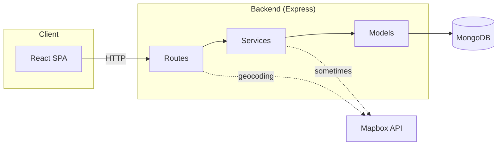
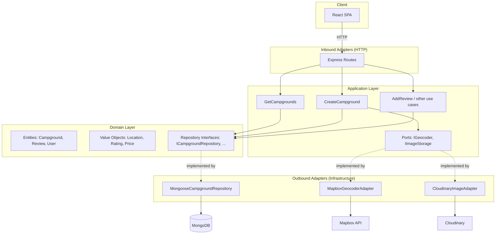

# Clean Architecture + DDD Migration Guide

This document explains the target architecture for Stonehaven: **Clean Architecture** with **Domain-Driven Design (DDD)** tactical patterns, built on the **Hexagonal (Ports & Adapters)** foundation. It covers what each layer means, what would change, and how to migrate incrementally.

> **Hexagonal is not replaced — it is enforced.** Clean Architecture adopts the same dependency inversion principle as hexagonal. The difference is that Clean Architecture and DDD are more prescriptive about *what goes in each layer* and *how the domain is modeled*.

See also:
- [STRATEGY.md](./STRATEGY.md) — single source of truth for project direction and decision guide
- [DOCKER.md](./DOCKER.md) — containerisation, Redis broker, dev/prod compose setup
- [AWS_ARCHITECTURE.md](./AWS_ARCHITECTURE.md) — AWS infrastructure plan, Lambda deployment, Terraform IaC

---

## 1. Recommendation: Should This Project Adopt This Architecture?

**Short answer: adopt now — this is a prerequisite for the planned AWS Lambda deployment (see [STRATEGY.md](./STRATEGY.md)).**

| Factor | Assessment |
|--------|------------|
| **Project size** | Small–medium (campgrounds, reviews, users). One DB (MongoDB), one API (Express). |
| **Team** | Small. Layered structure is already understandable. |
| **Planned changes** | AWS Lambda deployment requires swapping adapters (DynamoDB, JWT, S3). This migration decouples business logic from Mongoose/Passport/Cloudinary. |
| **Cost** | More folders, interfaces, and DI wiring. Justified by the concrete need to swap infrastructure adapters for AWS. |

**Recommendation:**

- **Phase 1** (now): Introduce repository interfaces + simple DI. Immediate gain in testability and SOLID compliance. **This is Phase 0 in STRATEGY.md** — it must complete before any AWS work begins.
- **Phase 2**: Extract use cases; move geocoding behind a port. Routes become thin HTTP adapters.
- **Phase 3**: Enrich the domain layer with DDD tactical patterns (Value Objects, Domain Events, Aggregates) as the domain complexity grows.

You can stop at Phase 1–2 and still gain most of the benefits.

---

## 2. Architecture Overview: The Combined Approach

### 2.1 Hexagonal / Ports & Adapters (Foundation)

**Hexagonal** (Alistair Cockburn), also called **Ports & Adapters**, puts **application logic in the center** and treats everything else (HTTP, database, external APIs) as **pluggable adapters** that implement **ports** (interfaces).

#### Core ideas

1. **Domain / application core**
   Contains business rules and use cases. It does **not** import Express, Mongoose, or any framework. It only depends on **interfaces** (ports).

2. **Ports (driving and driven)**
   - **Driving (inbound):** "How the app is used" — e.g. "handle CreateCampgroundRequest". Implemented by adapters that call into the core.
   - **Driven (outbound):** "What the app needs from the outside" — e.g. "persist a campground", "geocode an address". The core defines the interface; adapters implement it (DB, Mapbox, etc.).

3. **Adapters**
   Concrete implementations of ports: Express routes (driving), Mongoose repository (driven), Mapbox client (driven), etc.

4. **Dependency rule**
   Dependencies point **inward**: adapters depend on ports; the core depends only on ports (interfaces), never on adapters.

### 2.2 Clean Architecture (Concentric Layers)

Clean Architecture (Robert C. Martin) formalizes hexagonal into **four concentric circles**. The dependency rule is the same: **source code dependencies must point inward only**.

```text
  ┌────────────────────────────────────────────────┐
  │  INFRASTRUCTURE / ADAPTERS  (outermost)        │
  │  ┌──────────────────────────────────────────┐  │
  │  │  APPLICATION (Use Cases)                 │  │
  │  │  ┌────────────────────────────────────┐  │  │
  │  │  │  DOMAIN (Entities, Value Objects,  │  │  │
  │  │  │  Repository Interfaces)  (innermost)│  │  │
  │  │  └────────────────────────────────────┘  │  │
  │  └──────────────────────────────────────────┘  │
  └────────────────────────────────────────────────┘
```

| Layer | Responsibility | May depend on |
|-------|---------------|---------------|
| **Domain** | Entities, Value Objects, domain rules, repository *interfaces* | Nothing outside itself |
| **Application** | Use cases, application service *interfaces* (ports) for non-domain services | Domain only |
| **Adapters** | HTTP routes, Mongoose repos, Mapbox client, Cloudinary | Application + Domain (via interfaces) |
| **Infrastructure** | Framework setup, DB connection, DI composition root | Everything (but only at startup) |

### 2.3 Domain-Driven Design — Tactical Patterns

DDD adds a vocabulary and a set of building blocks for modeling the domain layer:

| Pattern | Description | Stonehaven example |
|---------|-------------|-------------------|
| **Entity** | Object with identity that persists over time | `Campground`, `Review`, `User` |
| **Value Object** | Immutable concept identified by its value, not id | `Location`, `Rating`, `Price` |
| **Aggregate** | Cluster of entities/VOs with one root; ensures consistency | `Campground` as root, `Review` as child |
| **Repository** | Interface defined in domain that abstracts persistence | `ICampgroundRepository` lives in `domain/repositories/` |
| **Domain Event** | Something meaningful that happened in the domain | `CampgroundCreated`, `ReviewPosted` |
| **Use Case / Application Service** | Orchestrates domain objects to fulfill one business operation | `CreateCampground`, `AddReview` |

> **Key DDD insight**: repository *interfaces* belong to the **domain layer**, not the application layer. The domain says "I need something that can find and save campgrounds" — the implementation detail (Mongoose, Prisma, memory) lives in the adapters layer.

---

## 3. What Would Change (Concrete List)

### 3.1 Folder Structure

**Current (simplified):**

```
src/backend/src/
  api/routes/      → HTTP, call services directly
  config/          → DB, Passport, Mapbox, etc.
  middleware/
  models/          → Mongoose schemas (data + persistence)
  services/        → Business logic + direct model access
  types/
  utils/
  validation/
```

**Target (Clean Architecture + DDD + Hexagonal):**

```
src/backend/src/
  domain/                       # CORE — innermost circle (no external deps)
    entities/                   # Rich domain objects with identity
      Campground.ts
      Review.ts
      User.ts
    value-objects/              # Immutable concepts (no identity)
      Location.ts               # lat/lng + address
      Rating.ts                 # 1–5, validates itself
      Price.ts                  # amount + currency
    repositories/               # ✅ Interfaces defined HERE (domain owns the contract)
      ICampgroundRepository.ts
      IReviewRepository.ts
      IUserRepository.ts
    events/                     # Domain events (optional, Phase 3)
      CampgroundCreated.ts
      ReviewPosted.ts

  application/                  # USE CASES — orchestrates domain objects
    use-cases/
      campgrounds/
        GetCampgrounds.ts
        CreateCampground.ts
        UpdateCampground.ts
        DeleteCampground.ts
      reviews/
        AddReview.ts
        DeleteReview.ts
      users/
        RegisterUser.ts
        LoginUser.ts
    ports/                      # Application-level port interfaces (non-domain services)
      IGeocoder.ts              # "given an address, return coordinates"
      IImageStorage.ts          # "store image, return URL"

  adapters/                     # INFRASTRUCTURE — outermost circle
    inbound/
      http/                     # Express routes (driving adapters)
        campgrounds.routes.ts
        reviews.routes.ts
        users.routes.ts
        home.routes.ts
    outbound/
      persistence/              # Implements domain's repository interfaces
        MongooseCampgroundRepository.ts   # uses existing Campground model internally
        MongooseReviewRepository.ts
        MongooseUserRepository.ts
      geocoding/
        MapboxGeocoderAdapter.ts          # implements IGeocoder
      storage/
        CloudinaryImageAdapter.ts         # implements IImageStorage

  config/                       # Framework config; used only by adapters/composition root
  middleware/
  types/
  utils/
  validation/
```

> **Note on `models/`:** Mongoose schemas become an *implementation detail* of the persistence adapters. They do not need to move; `MongooseCampgroundRepository` imports and uses them internally. The domain entity `Campground.ts` is a plain TypeScript class/interface with no Mongoose dependency.

### 3.2 Code Changes

| Area | Current | After migration |
|------|--------|------------------|
| **Persistence** | Services call `Campground.find()`, `campground.save()` | Use cases call `ICampgroundRepository.findAll()`, `save(campground)`; `MongooseCampgroundRepository` implements it and uses the Mongoose model internally. |
| **Geocoding** | Routes/services call `geocoder.forwardGeocode()` directly | `CreateCampground` use case receives `IGeocoder`; the Mapbox adapter is injected at startup. |
| **Routes** | Import `campgroundService` singleton, call methods | Receive use case via DI; route only maps HTTP ↔ DTOs and calls the use case. |
| **Domain types** | Flat objects / Mongoose documents | Typed domain entities; Value Objects enforce invariants (e.g. `Rating` rejects values outside 1–5). |
| **Testing** | Service tests use real Mongo or in-memory Mongoose | Use case tests inject mock repositories and mock ports — no DB, no HTTP, no external services. |
| **Wiring** | `campgroundService = new CampgroundService()` in services | Composition root (`index.ts` or `container.ts`) builds adapters and injects them into use cases. |

---

## 4. Component Diagrams

### 4.1 Current Architecture (Layered)

Flow: **HTTP → Routes → Services → Models (Mongoose) → DB**. Routes also call external services (e.g. Mapbox) directly.

```text
                    ┌─────────────────────────────────────────────────────────┐
                    │                     BACKEND (Node/Express)               │
                    │                                                          │
   Client (React)   │   ┌──────────────┐     ┌──────────────┐     ┌─────────┐ │
        │           │   │   Routes     │────▶│   Services   │────▶│ Models  │ │
        │  HTTP     │   │ (Express)    │     │ (singletons) │     │(Mongoose)│ │
        └───────────┼──▶│              │     │              │     │         │ │
                    │   │ - campgrounds│     │ - Campground │     └────┬────┘ │
                    │   │ - reviews    │     │ - Review     │          │      │
                    │   │ - users      │     │ - User       │          │      │
                    │   │ - home       │     └──────┬───────┘          │      │
                    │   └──────┬───────┘            │                  │      │
                    │          │                    │                  ▼      │
                    │          │                    │            ┌──────────┐ │
                    │          │                    │            │ MongoDB  │ │
                    │          │                    │            └──────────┘ │
                    │          │                    │                         │
                    │          │                    └──────────▶ Mapbox (geo) │
                    │          │                    (used from route or svc)  │
                    └─────────────────────────────────────────────────────────┘
```

**Mermaid (current):**



---

### 4.2 Target Architecture (Clean Architecture + DDD + Hexagonal)

Flow: **HTTP adapter** calls **use cases**; use cases operate on **domain entities** via **repository interfaces**; **outbound adapters** implement those interfaces. Dependencies point inward.

```text
                    ┌─────────────────────────────────────────────────────────────────────┐
                    │                  BACKEND (Clean Architecture + DDD)                 │
                    │                                                                     │
   Client (React)   │  ┌──────────────────────── ADAPTERS ───────────────────────────┐  │
        │           │  │  Inbound                              Outbound               │  │
        │  HTTP     │  │  ┌─────────────────┐     ┌──────────────────────────────┐  │  │
        └───────────┼──┼─▶│  HTTP (Express) │     │  MongooseCampgroundRepository│  │  │
                    │  │  │  - routes       │     │  MongooseReviewRepository     │  │  │
                    │  │  │  - middleware   │     │  MapboxGeocoderAdapter        │  │  │
                    │  │  └────────┬────────┘     │  CloudinaryImageAdapter       │  │  │
                    │  └───────────┼──────────────┴──────────────┬────────────────┘  │
                    │              │                              │                   │
                    │              ▼                             ▲                   │
                    │  ┌──────────────────────── APPLICATION ───┼───────────────┐   │
                    │  │                                         │               │   │
                    │  │  ┌──────────────────────────┐   ┌──────┴─────────────┐ │   │
                    │  │  │  Use Cases               │   │  Ports (interfaces)│ │   │
                    │  │  │  CreateCampground         │──▶│  IGeocoder         │ │   │
                    │  │  │  GetCampgrounds           │   │  IImageStorage     │ │   │
                    │  │  │  AddReview, ...           │   └────────────────────┘ │   │
                    │  │  └──────────┬───────────────┘                          │   │
                    │  └────────────┼──────────────────────────────────────────┘   │
                    │               │                                               │
                    │               ▼                                               │
                    │  ┌──────────────────────────── DOMAIN ───────────────────┐   │
                    │  │                                                        │   │
                    │  │  Entities        Value Objects    Repository Interfaces│   │
                    │  │  Campground       Location         ICampgroundRepository│   │
                    │  │  Review           Rating           IReviewRepository   │   │
                    │  │  User             Price            IUserRepository     │   │
                    │  │                                                        │   │
                    │  │              [Domain Events — optional]                │   │
                    │  │               CampgroundCreated, ReviewPosted          │   │
                    │  └────────────────────────────────────────────────────────┘   │
                    └─────────────────────────────────────────────────────────────────┘
                                                        │
                    ┌──────────────── EXTERNAL ──────────┘
                    │  ┌──────────┐   ┌────────────┐   ┌───────────┐
                    │  │ MongoDB  │   │ Mapbox API │   │Cloudinary │
                    │  └──────────┘   └────────────┘   └───────────┘
                    └────────────────────────────────────────────────
```

**Mermaid (target):**



---

### 4.3 The Dependency Rule

This is the single rule that governs all layers. **Source code dependencies point inward only.**

```text
  ┌─────────────────────────────────────────┐
  │           DOMAIN LAYER                  │
  │  ┌──────────────────────────────────┐   │
  │  │  Entities, Value Objects         │   │
  │  │  Domain Events                   │   │
  │  │  Repository Interfaces ◀─────────┼───┼── domain defines what it needs
  │  └──────────────────────────────────┘   │
  └─────────────────────────────────────────┘
                     ↑
                     │ depends on
  ┌─────────────────────────────────────────┐
  │        APPLICATION LAYER                │
  │  ┌──────────────────────────────────┐   │
  │  │  Use Cases                       │   │
  │  │  Application Port Interfaces ◀───┼───┼── app defines non-domain services it needs
  │  └──────────────────────────────────┘   │
  └─────────────────────────────────────────┘
                     ↑
                     │ depends on
  ┌─────────────────────────────────────────┐
  │          ADAPTERS LAYER                 │
  │  ┌──────────────────────────────────┐   │
  │  │  MongooseCampgroundRepository    │   │── implements domain's ICampgroundRepository
  │  │  MapboxGeocoderAdapter           │   │── implements application's IGeocoder
  │  │  Express HTTP Routes             │   │── calls use cases
  │  └──────────────────────────────────┘   │
  └─────────────────────────────────────────┘
```

- **Domain** has zero external dependencies.
- **Application** depends only on domain.
- **Adapters** depend on application and domain (via interfaces), never the other way around.

---

## 5. Step-by-Step Migration Path

You can do this incrementally without a big-bang rewrite. Each step is independently shippable.

---

### Step 1 — Introduce Repository Interfaces (Ports)

**Goal:** Decouple use cases/services from Mongoose.

- Create `domain/repositories/ICampgroundRepository.ts` (and similarly for review, user) defining methods like `findAll()`, `findById()`, `save()`, `delete()`.
- Keep existing **services** but change them to receive the repository interface in their constructor instead of calling `Campground.find()` directly.
- Implement `MongooseCampgroundRepository` in `adapters/outbound/persistence/` — this class wraps the existing Mongoose model and implements the interface.

```typescript
// domain/repositories/ICampgroundRepository.ts
export interface ICampgroundRepository {
  findAll(): Promise<Campground[]>;
  findById(id: string): Promise<Campground | null>;
  save(campground: Campground): Promise<Campground>;
  delete(id: string): Promise<void>;
}

// adapters/outbound/persistence/MongooseCampgroundRepository.ts
export class MongooseCampgroundRepository implements ICampgroundRepository {
  async findAll() { return CampgroundModel.find(); }
  // ...
}
```

**Result:** Services/use cases depend on an interface; one concrete implementation (Mongoose). Tests inject a mock repository — no DB required.

---

### Step 2 — Wire Dependencies (Composition Root)

**Goal:** Remove global service singletons; inject dependencies at startup.

- Create a composition root (`index.ts` or a `container.ts`) that:
  1. Builds adapters: `new MongooseCampgroundRepository()`
  2. Builds use cases / services with those adapters injected
  3. Passes use cases into route factories
- Routes no longer `import campgroundService` as a global; they receive it when the app boots.

**Result:** Full dependency inversion; services are easily replaceable; no hidden globals.

---

### Step 3 — Extract Use Cases

**Goal:** Make each business operation an explicit, named unit in `application/use-cases/`.

- Move each operation (get campgrounds, create campground, add review, etc.) into a small class or function that receives **only ports** (repository interfaces and application ports).
- Introduce `IGeocoder` in `application/ports/IGeocoder.ts` and a `MapboxGeocoderAdapter` in outbound adapters.
- The `CreateCampground` use case receives `ICampgroundRepository` + `IGeocoder`; the Express route only maps the HTTP request to a DTO and calls the use case.

```typescript
// application/use-cases/campgrounds/CreateCampground.ts
export class CreateCampground {
  constructor(
    private readonly campgroundRepo: ICampgroundRepository,
    private readonly geocoder: IGeocoder,
  ) {}

  async execute(dto: CreateCampgroundDto): Promise<Campground> {
    const location = await this.geocoder.forwardGeocode(dto.location);
    const campground = new Campground({ ...dto, location });
    return this.campgroundRepo.save(campground);
  }
}
```

**Result:** Routes are thin HTTP adapters. All orchestration and rules live in the use case. Use cases are 100% testable without Express or MongoDB.

---

### Step 4 — Introduce Domain Entities

**Goal:** Add typed domain objects that express business rules inside the domain layer.

- Add `domain/entities/Campground.ts` as a plain TypeScript class (no Mongoose). It holds the campground's state and can enforce basic invariants.
- The `MongooseCampgroundRepository` maps between domain entities and Mongoose documents (mapper pattern).
- Use cases work with domain entities; the repository interface uses them too.

```typescript
// domain/entities/Campground.ts  (no imports from outside domain/)
export class Campground {
  constructor(
    public readonly id: string,
    public readonly title: string,
    public readonly location: Location,   // Value Object
    public readonly price: Price,         // Value Object
    public readonly author: string,
  ) {}
}
```

**Result:** The domain layer is framework-agnostic and expresses intent clearly. Mongoose is an implementation detail hidden behind the repository.

---

### Step 5 — Add Value Objects and Invariants

**Goal:** Encode business rules in the type system; prevent invalid state from ever existing.

- Create `domain/value-objects/` with classes like `Location`, `Rating`, `Price`.
- Value Objects are immutable and validate themselves on construction.
- If a `Rating` of 6 is passed, it throws a domain error — not a HTTP 400, not an if-statement in a route.

```typescript
// domain/value-objects/Rating.ts
export class Rating {
  readonly value: number;

  constructor(value: number) {
    if (value < 1 || value > 5) throw new Error('Rating must be between 1 and 5');
    this.value = value;
  }
}
```

**Result:** Validation lives in the domain, not scattered across routes and services. Invalid objects cannot be constructed.

---

### Step 6 (Optional) — Domain Events

**Goal:** Decouple side effects (send email, invalidate cache, notify) from the use case that triggers them.

- Add `domain/events/` with event types like `CampgroundCreated`, `ReviewPosted`.
- Use cases emit domain events; a lightweight event dispatcher (or an `EventEmitter` wrapper) routes them to handlers.
- Handlers live in the adapters layer (e.g. `SendWelcomeEmailHandler`).

**Result:** Use cases stay focused on their primary job. Side effects are pluggable and independently testable.

---

### Step 7 (Optional) — Aggregates and Bounded Contexts

**Goal:** Define clear consistency boundaries and, if the project grows substantially, separate domains.

- Identify **aggregates**: e.g. `Campground` is the aggregate root; `Review` is always created/deleted through a campground, not independently.
- Enforce that `Review` is only modified via `Campground` methods (`campground.addReview(...)`, `campground.removeReview(...)`).
- If distinct feature areas emerge (e.g. booking, payments), consider separating them into **bounded contexts** with their own models and repositories.

**Result:** Consistency guarantees enforced at the domain level, not at the database or service level.

---

## 6. Connection to Event-Driven Architecture and AWS Lambda

This architecture migration is not purely academic — it is the **prerequisite** for deploying to AWS Lambda and building an event-driven system. The connection is direct.

### 6.1 Why Clean Architecture enables Lambda

With a layered architecture, each Lambda invocation would need to boot the full Express middleware stack (sessions, Passport, CORS, helmet). Clean Architecture removes that coupling:

| What changes | Layered (current) | Clean Architecture |
|-------------|------------------|--------------------|
| **Lambda handler** | Wraps Express app (`serverless-express`) — entire middleware boots per invocation | Thin adapter: parse event → call use case → return response. No Express in Lambda. |
| **DB connection** | Coupled to app startup | Initialised once outside handler; reused across warm invocations |
| **Swapping DB (Mongo → DynamoDB)** | Touch services, routes, models | Implement a new `DynamoDBCampgroundRepository`; swap in composition root |
| **Async side effects** | Hard-coded in service | Use case emits a domain event; `SNSEventPublisher` adapter publishes to AWS SNS |
| **Testing** | Needs DB + HTTP | Use case tests inject mocks; zero infrastructure required |

### 6.2 Domain Events → SNS → SQS → Lambda Workers

Steps 6 and 7 (Domain Events and domain event ports) map directly onto the AWS event-driven layer:

```text
  Use Case (CreateCampground)
       │
       │  emits  CampgroundCreated { campgroundId, imageUrls, ... }
       ▼
  IEventPublisher port
       │
       ├── Local (dev):   BullMQEventPublisher  →  Redis queue  →  Worker process
       └── AWS (prod):    SNSEventPublisher      →  SNS topic   →  SQS queue  →  Lambda
```

The use case is identical in both environments. Only the adapter is swapped.

### 6.3 Recommended order of work

```text
  Phase 0 (now)           Phase 1               Phase 2
  ─────────────           ────────────          ────────────────────
  Steps 1–3:              Docker +               Lambda + SQS/SNS
  Repository ports,       Redis wired,           deployed on AWS
  use cases, DI           health checks          (see AWS_ARCHITECTURE.md)
       │                       │                       │
       ▼                       ▼                       ▼
  Architecture          Container-ready         Event-driven serverless
  is clean              for AWS ECS/Lambda      fully operational
```

See [AWS_ARCHITECTURE.md](./AWS_ARCHITECTURE.md) for the full infrastructure plan, Terraform structure, Lambda deployment details, and migration phases.
See [DOCKER.md](./DOCKER.md) for containerisation, Redis broker setup, and the dev/prod compose configurations.

---

## 7. Summary

| Question | Answer |
|----------|--------|
| **What is the target architecture?** | Clean Architecture (concentric layers) + DDD tactical patterns (entities, value objects, aggregates, domain events) + Hexagonal (ports & adapters). All three reinforce the same dependency rule. |
| **What does Hexagonal add?** | The ports-and-adapters pattern: inbound (HTTP routes) and outbound (persistence, geocoding) adapters implement interfaces; the core never depends on concrete infrastructure. |
| **What does Clean Architecture add?** | A clear naming and layering convention: Domain → Application → Adapters/Infrastructure. The dependency rule is made explicit. |
| **What does DDD add?** | Tactical building blocks for modeling the domain: entities with identity, value objects with invariants, aggregates as consistency boundaries, domain events for decoupled side effects. Repository interfaces live in the domain, not the application layer. |
| **What changes in the codebase?** | New folders (`domain/`, `application/use-cases/`, `application/ports/`, `adapters/`); repository interfaces; domain entities and value objects; DI wiring in composition root; thin HTTP routes. |
| **Can I migrate incrementally?** | Yes. Steps 1–3 (repository interfaces, DI, use cases) already provide most of the SOLID and testability benefits. Steps 4–7 add DDD richness as the domain grows. |
| **Does the architecture enable Lambda?** | Yes — this is the primary practical motivation. Use cases with no Express dependency become Lambda handlers trivially. Domain events become SNS messages. Repository adapters are swapped for DynamoDB or DocumentDB without touching business logic. |
| **Diagram** | See Section 4: current (layered) vs target (Clean Architecture + DDD) and the dependency rule. |
